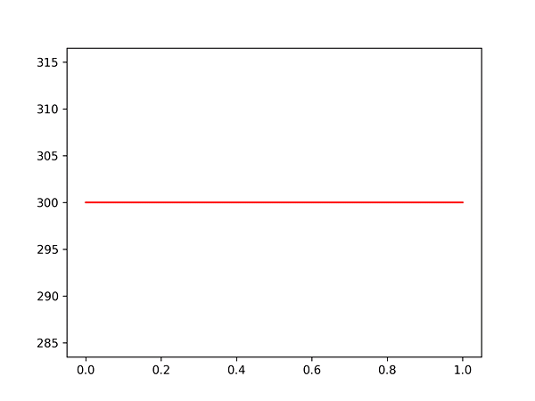
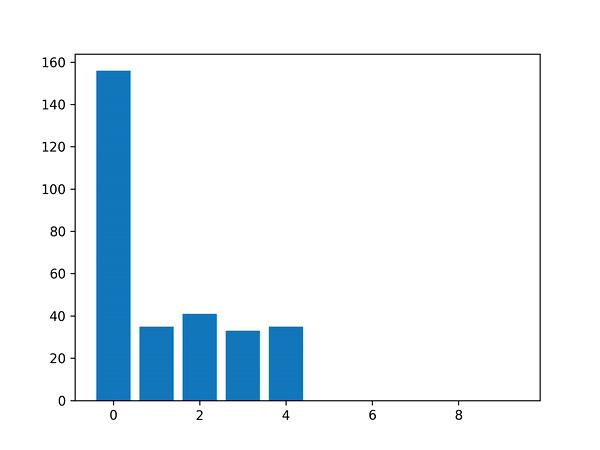
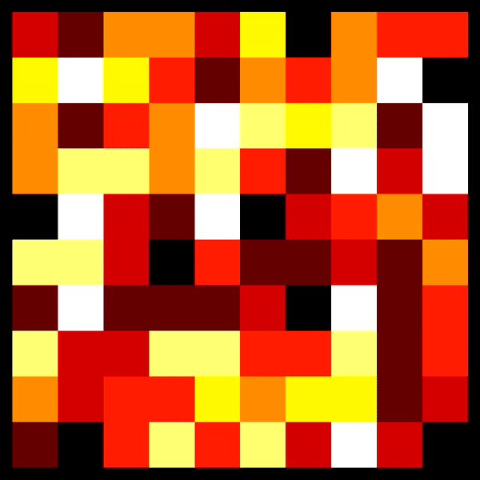

Hi!

For this year's Advent of Code, I've set myself the challenge to visualize every puzzle I can solve. Hopefully by the end of December there will be 25 visualizations below. 

You can find the code for the visualizations alongside the solutions to each puzzle, named *dayXX_vis.py*

#### Day 1

#### Day 2

#### Day 3

#### Day 4

#### Day 5

#### Day 6

#### Day 7

#### Day 8

#### Day 9

#### Day 10

#### Day 11

