# Warning: Flashing gifs below

Hi!

For this year's Advent of Code, I've set myself the challenge to visualize every puzzle I can solve. Hopefully by the end of December there will be 25 visualizations below. 

You can find the code for the visualizations alongside the solutions to each puzzle, named *dayXX_vis.py*

#### Quicklinks:

[Day 1 - Sonar Sweep](#day-1---sonar-sweep)

[Day 2 - Dive!](#day-2---dive!)

[Day 3 - Binary Diagnostic](#day-3---binary-diagnostic)

[Day 4 - Sonar Sweep](#day-4---giant-squid)

[Day 5 - Hydrothermal Venture](#day-5---hydrothermal-venture)

[Day 6 - Lanternfish](#day-6---lanternfish)

[Day 7 - The Treachery of Whales](#day-7---the-treachery-of-whales)

[Day 8 - Seven Segment Search](#day-8---seven-segment-search)

[Day 9 - Smoke Basin](#day-9---smoke-basin)

[Day 10 - Syntax Scoring](#day-10---syntax-scoring)

[Day 11 - Dumbo Octopus](#day-11---dumbo-octopus)

[Day 12 - Passage Pathing](#day-12---passage-pathing)

[Day 13 - Transparent Origami](#day-13---transparent-origami)

[Day 14 - Extended Polymerization](#day-14---extended-polymerization)

[Day 15 - Chiton](#day-15---chiton)

[Day 16 - Packet Decoder](#day-16---packet-decoder)

[Day 17 - Trick Shot](#day-17---trick-shot)

#### Day 1 - Sonar Sweep

##### Ocean floor in sonar sweep

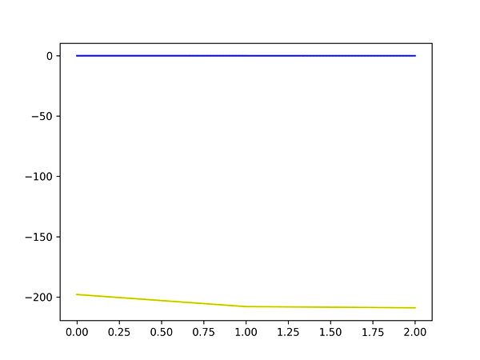

#### Day 2 - Dive!

##### Ocean floor vs. the route our submarine takes

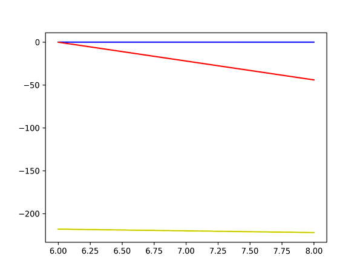

#### Day 3 - Binary Diagnostic

##### Distribution of 1s and 0s at each index

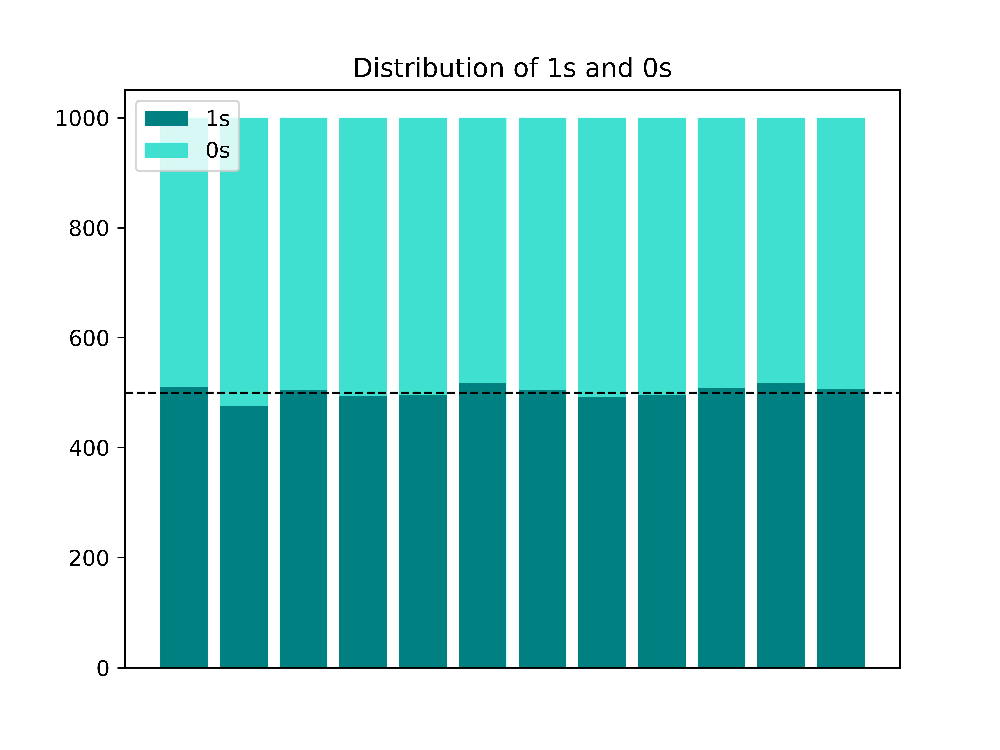

#### Day 4 - Giant Squid

##### Playing 100 boards of bingo

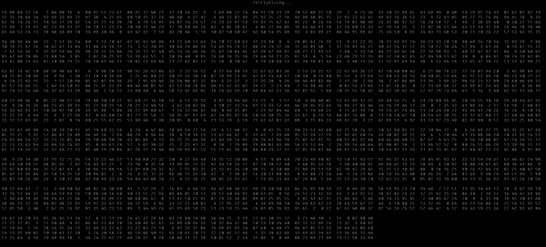

#### Day 5 - Hydrothermal Venture

##### Danger-spots where two or more geyser-lines overlap

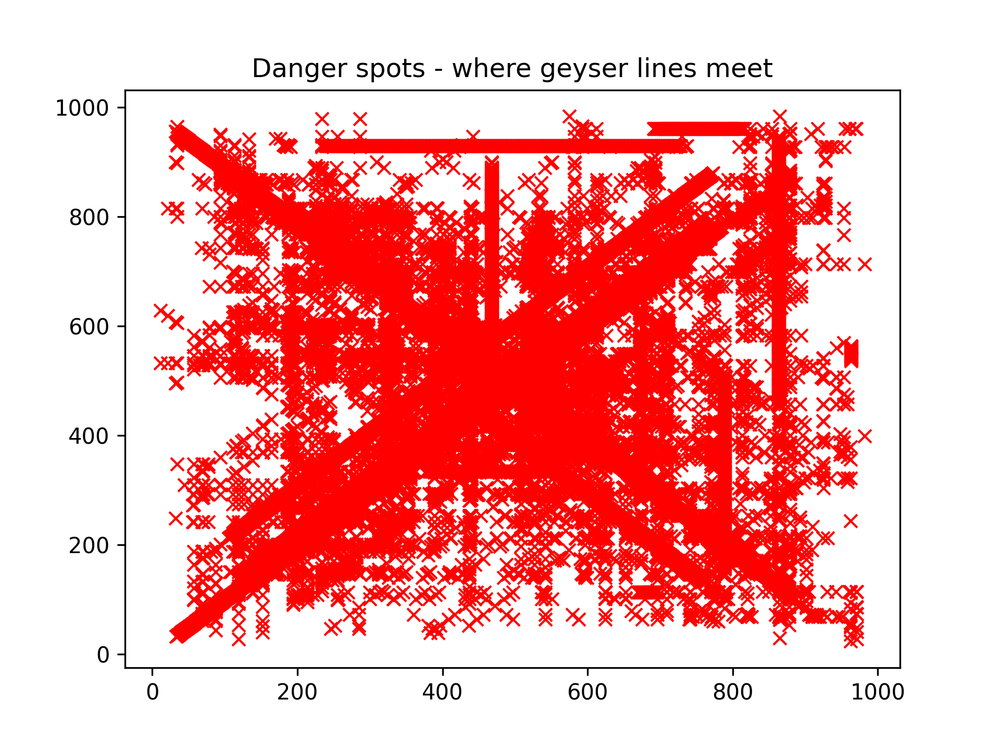

#### Day 6 - Lanternfish

##### Growth rate of lanternfish

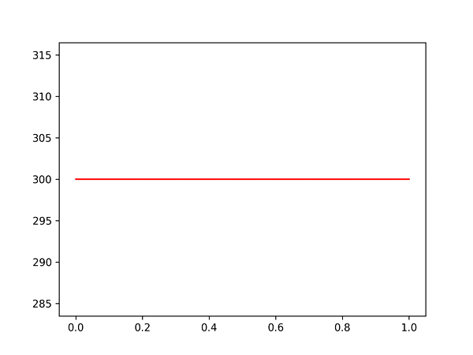

##### Time until birth for our lanternfish

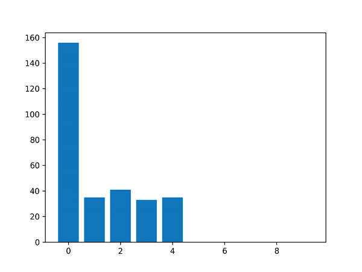

#### Day 7 - The Treachery of Whales

##### Crabs and the fuel consumption of their submarines

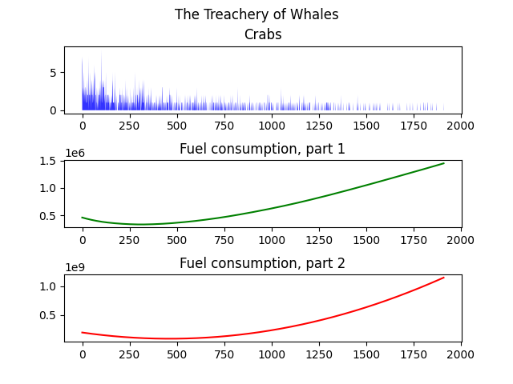

#### Day 8 - Seven Segment Search

##### Decoding each line

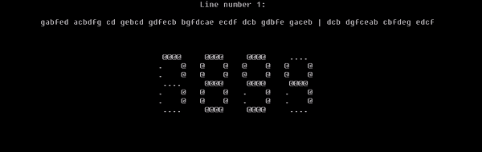

#### Day 9 - Smoke Basin

##### Heatmap of the cave system to show basins

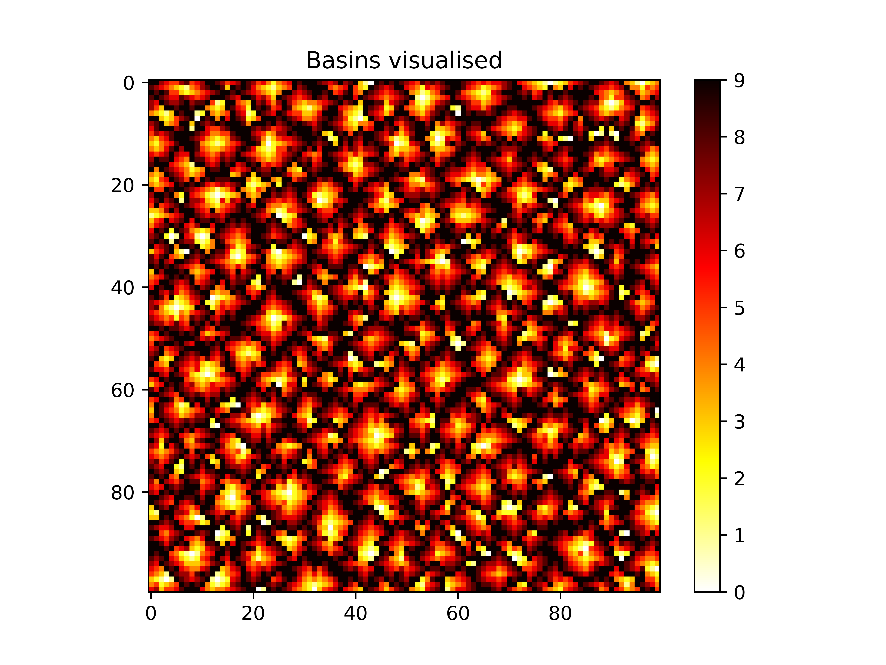

#### Day 10 - Syntax Scoring

##### Each line and what's wrong with it

#### Day 11 - Dumbo Octopus

##### Flashing octopi until they're synchronized

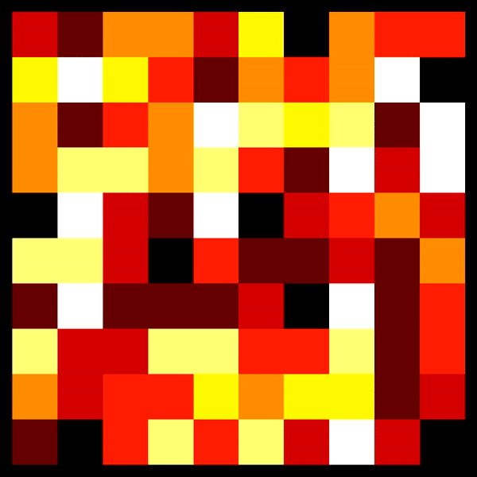

#### Day 12 - Passage Pathing

##### Map of our cave system

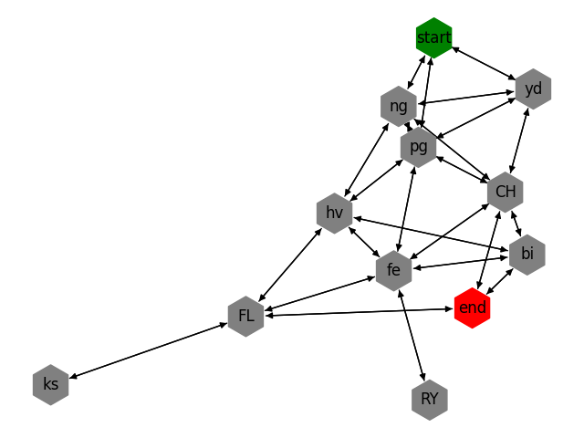

#### Day 13 - Transparent Origami

##### Message on our folded piece of paper

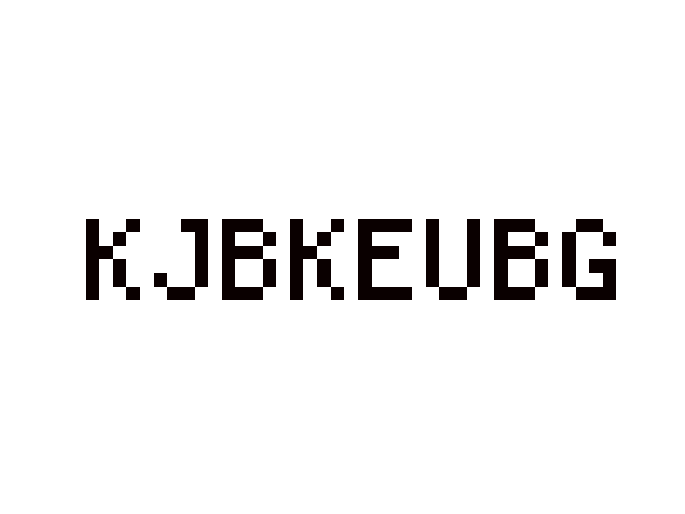

#### Day 14 - Extended Polymerization

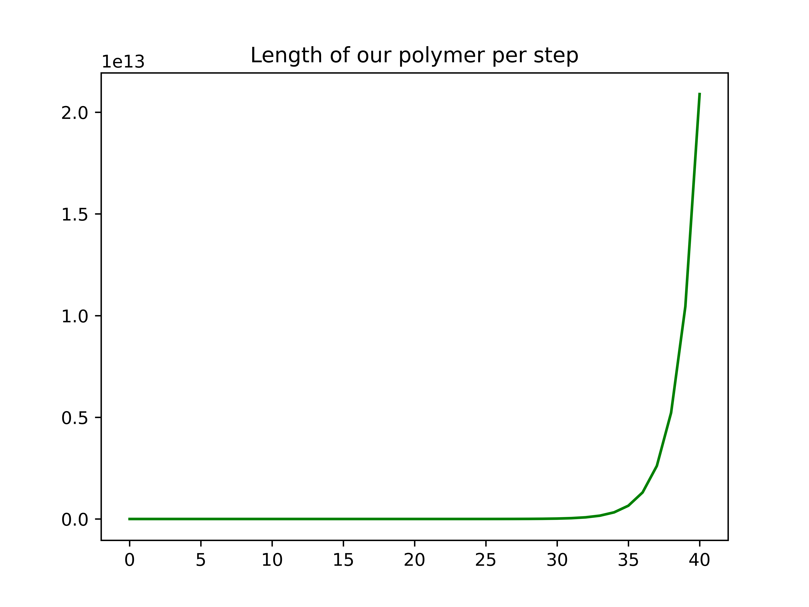

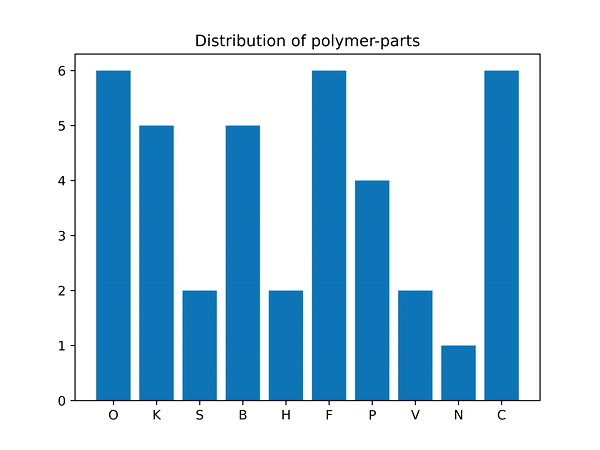

#### Day 15 - Chiton

##### A graph of the weighted connections in our initial cave system *(or: an illustration of the brain gymnastics I did while solving this puzzle)*

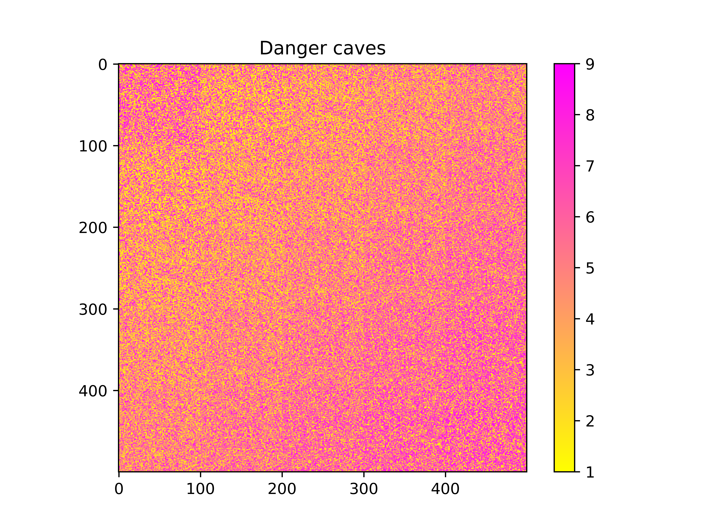

#### Day 16 - Packet Decoder

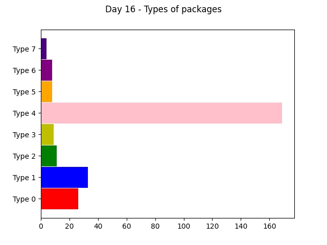

#### Day 17 - Trick Shot

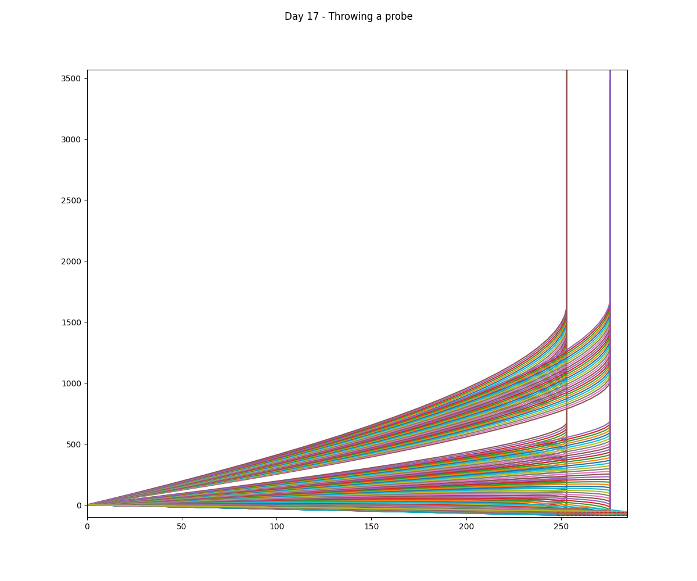